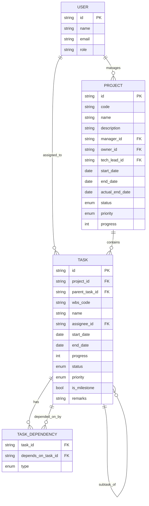

# Database Schema

PostgreSQL, diakses lewat Prisma.

## ERD



## Tabel

### users

| Kolom | Tipe | Keterangan |
|---|---|---|
| id | uuid PK | |
| name | text | |
| email | text unique | |
| role | text | mis. `admin`, `member` |
| created_at | timestamptz | |

### projects

| Kolom | Tipe | Keterangan |
|---|---|---|
| id | uuid PK | |
| code | text unique | contoh `PRJ-001` |
| name | text | |
| description | text | |
| manager_id | uuid FK → users.id | |
| owner_id | uuid FK → users.id | business owner |
| tech_lead_id | uuid FK → users.id nullable | |
| start_date | date | |
| end_date | date | |
| actual_end_date | date nullable | |
| status | enum `project_status` | default `not_started` |
| priority | enum `priority_level` | default `medium` |
| progress | smallint | 0–100, dihitung dari rata-rata task |
| created_at | timestamptz | |
| updated_at | timestamptz | |

### tasks

| Kolom | Tipe | Keterangan |
|---|---|---|
| id | uuid PK | |
| project_id | uuid FK → projects.id | on delete cascade |
| parent_task_id | uuid FK → tasks.id nullable | untuk subtask |
| wbs_code | text | contoh `1`, `1.1` |
| name | text | |
| assignee_id | uuid FK → users.id nullable | |
| start_date | date | |
| end_date | date | |
| progress | smallint | 0–100 |
| status | enum `project_status` | reuse enum yang sama dengan project |
| priority | enum `priority_level` | |
| is_milestone | boolean | default false |
| remarks | text nullable | |
| created_at | timestamptz | |
| updated_at | timestamptz | |

### task_dependencies

Normalisasi dari field `dependency` (single FS reference) di versi lama menjadi tabel relasi, agar satu task bisa punya lebih dari satu predecessor.

| Kolom | Tipe | Keterangan |
|---|---|---|
| task_id | uuid FK → tasks.id | task yang bergantung |
| depends_on_task_id | uuid FK → tasks.id | predecessor |
| type | enum `dependency_type` | default `FS` (Finish-to-Start) |

Primary key komposit: `(task_id, depends_on_task_id)`.

## Enum

```
project_status: not_started | planning | in_progress | on_hold | completed | delayed
priority_level: high | medium | low
dependency_type: FS | SS | FF | SF
```

## Index

- `tasks(project_id)`
- `tasks(parent_task_id)`
- `projects(status)`
- `projects(priority)`

## Prisma Schema

```prisma
model User {
  id        String    @id @default(uuid())
  name      String
  email     String    @unique
  role      String    @default("member")
  createdAt DateTime  @default(now())

  managedProjects Project[] @relation("ProjectManager")
  ownedProjects   Project[] @relation("ProjectOwner")
  leadProjects    Project[] @relation("ProjectTechLead")
  tasks           Task[]
}

enum ProjectStatus {
  not_started
  planning
  in_progress
  on_hold
  completed
  delayed
}

enum PriorityLevel {
  high
  medium
  low
}

enum DependencyType {
  FS
  SS
  FF
  SF
}

model Project {
  id             String        @id @default(uuid())
  code           String        @unique
  name           String
  description    String?
  managerId      String
  ownerId        String
  techLeadId     String?
  startDate      DateTime
  endDate        DateTime
  actualEndDate  DateTime?
  status         ProjectStatus @default(not_started)
  priority       PriorityLevel @default(medium)
  progress       Int           @default(0)
  createdAt      DateTime      @default(now())
  updatedAt      DateTime      @updatedAt

  manager  User   @relation("ProjectManager", fields: [managerId], references: [id])
  owner    User   @relation("ProjectOwner", fields: [ownerId], references: [id])
  techLead User?  @relation("ProjectTechLead", fields: [techLeadId], references: [id])
  tasks    Task[]
}

model Task {
  id            String        @id @default(uuid())
  projectId     String
  parentTaskId  String?
  wbsCode       String
  name          String
  assigneeId    String?
  startDate     DateTime
  endDate       DateTime
  progress      Int           @default(0)
  status        ProjectStatus @default(not_started)
  priority      PriorityLevel @default(medium)
  isMilestone   Boolean       @default(false)
  remarks       String?
  createdAt     DateTime      @default(now())
  updatedAt     DateTime      @updatedAt

  project      Project @relation(fields: [projectId], references: [id], onDelete: Cascade)
  parentTask   Task?   @relation("Subtask", fields: [parentTaskId], references: [id])
  subtasks     Task[]  @relation("Subtask")
  assignee     User?   @relation(fields: [assigneeId], references: [id])

  dependsOn    TaskDependency[] @relation("TaskDependent")
  dependedBy   TaskDependency[] @relation("TaskPredecessor")

  @@index([projectId])
  @@index([parentTaskId])
}

model TaskDependency {
  taskId           String
  dependsOnTaskId  String
  type             DependencyType @default(FS)

  task        Task @relation("TaskDependent", fields: [taskId], references: [id], onDelete: Cascade)
  dependsOn   Task @relation("TaskPredecessor", fields: [dependsOnTaskId], references: [id], onDelete: Cascade)

  @@id([taskId, dependsOnTaskId])
}
```
